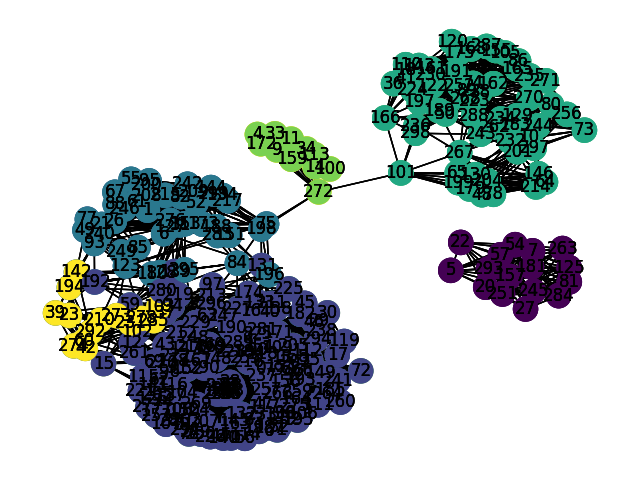

## MCL - Markov Clustering in APL (Dyalog APL)

This is a implementation of the algorithm MCL (more details [here](https://micans.org/mcl/)) in Dyalog APL.

The target of the MCL algorithm is to find clusters of nodes in a network.
The main idea is that che nodes more conected are likely to belongs at the same community.

 

In order to find clusters, MCL uses the simple idea of the random walk.
The idea is that if a random walk is started in a certain node and jump in a new edge n times randomly (using the weight of the edges as probabiliy coefficient), the probabily to be in a node in the same community of the starting node is high.

This point of view gives a markov chain and the problem to find the  probability of the random walk to be in a certain node after n steps is equivalent to find the power n of the matrix of the chain.

In order to increas the cluster segregation, as in a markov process is taken the power of the matrix but is added also an 'inflation' step that consist to take  power r of every coefficient (r is a parameter that affects the number of clusters) and renormalize the matrix by columns.

To summarize the process:

- Transform the adjacency matrix of the network in a probability matrix normalizing it by columns (a matrixk like that is called stochastic)
- expand the matrix, that it means take the power of the matrix
- inflate with r coefficient, that it means take the power r of every element
- repeat this process unitl convergence 

In APL the distance between the mathematical formlation and the code is really small.

##The code step by step

Input from csv, the matrix.csv contains the adjacency matrix comma separated. 
	
       matrix ← ⎕csv 'PATH TO MATRIX/matrix.csv'
 
InflateCoefficient that affects the number of cluster (the granularity)

       InflateCoef ← 1.2 

Transforming the matrix that is readed as matrix of strings in a matrix of numbers

       M ← ⍎¨ matrix

Definition of the function to obtain the Identity matrix , we'll need it

       id←{⍵ ⍵⍴1,⍵⍴0}

Normalization function by columns

       Nor←{+⌿⍵}
       Nmat ← {( ( ⍴ ⍵) ⍴ (Nor ⍵)) }
       NormColumn ← {( ⍴ ⍵ ) ⍴ ((×/⍴⍵) ⍴⍵)÷((×/⍴⍵)  ⍴ Nmat  ⍵ )}

Expansion and inflation functions

       Expand ← {⍵ +.× ⍵}
       Inflate  ←  NormColumn {  (⍴⍺) ⍴ (  (×/⍴⍺) ⍴  ⍺) * ⍵ } 

Here we normalize the input matrix

       M2 ← NormColumn (M + id (≢ M))
	
The MCL  step (in one row)
	
       MarkovCl ←  { ( Expand (NormColumn ⍵) ) Inflate InflateCoef }

And we apply it untill convergence (untill the matrix at step n is equal to the matrix at the prevous iteration )

       R ← (MarkovCl ⍣ ≡ ⊢ M2)

And we obtain a cluster map, a matrix with n rows and two columns 
where each row is \[vector i, cluster of vector i\]
 
       ClustMap ← ⌽↑⍸R

If you are an APL expert, please feel free to improve my code and to tell me (nicely) if I've done huge mistakes.

